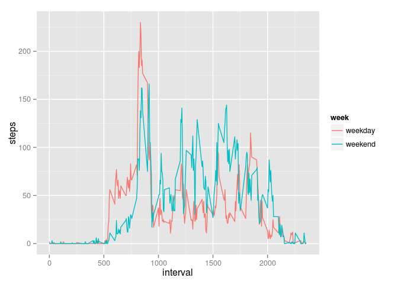

# Reproducible Research: Peer Assessment 1


```
## Loading required package: gsubfn
## Loading required package: proto
## Loading required package: RSQLite
## Loading required package: DBI
```

## Loading and preprocessing the data


## What is mean total number of steps taken per day?

```
## Loading required package: tcltk
## stat_bin: binwidth defaulted to range/30. Use 'binwidth = x' to adjust this.
```

 

Mean

```
## [1] 10766.19
```

Median

```
## [1] 10765
```

## What is the average daily activity pattern?
 

Max steps minute is

```
## [1] 104
```

???
## Imputing missing values
Total missing values is

```
## [1] 2304
```


```
## stat_bin: binwidth defaulted to range/30. Use 'binwidth = x' to adjust this.
```

 

```
## [1] "Date, Mean, Median"
```

```
## [1] "2012-10-01 : 36.9479166666667 : 33.5"
## [1] "2012-10-02 : 0.4375 : 0"
## [1] "2012-10-03 : 39.4166666666667 : 0"
## [1] "2012-10-04 : 42.0694444444444 : 0"
## [1] "2012-10-05 : 46.1597222222222 : 0"
## [1] "2012-10-06 : 53.5416666666667 : 0"
## [1] "2012-10-07 : 38.2465277777778 : 0"
## [1] "2012-10-08 : 36.9479166666667 : 33.5"
## [1] "2012-10-09 : 44.4826388888889 : 0"
## [1] "2012-10-10 : 34.375 : 0"
## [1] "2012-10-11 : 35.7777777777778 : 0"
## [1] "2012-10-12 : 60.3541666666667 : 0"
## [1] "2012-10-13 : 43.1458333333333 : 0"
## [1] "2012-10-14 : 52.4236111111111 : 0"
## [1] "2012-10-15 : 35.2048611111111 : 0"
## [1] "2012-10-16 : 52.375 : 0"
## [1] "2012-10-17 : 46.7083333333333 : 0"
## [1] "2012-10-18 : 34.9166666666667 : 0"
## [1] "2012-10-19 : 41.0729166666667 : 0"
## [1] "2012-10-20 : 36.09375 : 0"
## [1] "2012-10-21 : 30.6284722222222 : 0"
## [1] "2012-10-22 : 46.7361111111111 : 0"
## [1] "2012-10-23 : 30.9652777777778 : 0"
## [1] "2012-10-24 : 29.0104166666667 : 0"
## [1] "2012-10-25 : 8.65277777777778 : 0"
## [1] "2012-10-26 : 23.5347222222222 : 0"
## [1] "2012-10-27 : 35.1354166666667 : 0"
## [1] "2012-10-28 : 39.7847222222222 : 0"
## [1] "2012-10-29 : 17.4236111111111 : 0"
## [1] "2012-10-30 : 34.09375 : 0"
## [1] "2012-10-31 : 53.5208333333333 : 0"
## [1] "2012-11-01 : 36.9479166666667 : 33.5"
## [1] "2012-11-02 : 36.8055555555556 : 0"
## [1] "2012-11-03 : 36.7048611111111 : 0"
## [1] "2012-11-04 : 36.9479166666667 : 33.5"
## [1] "2012-11-05 : 36.2465277777778 : 0"
## [1] "2012-11-06 : 28.9375 : 0"
## [1] "2012-11-07 : 44.7326388888889 : 0"
## [1] "2012-11-08 : 11.1770833333333 : 0"
## [1] "2012-11-09 : 36.9479166666667 : 33.5"
## [1] "2012-11-10 : 36.9479166666667 : 33.5"
## [1] "2012-11-11 : 43.7777777777778 : 0"
## [1] "2012-11-12 : 37.3784722222222 : 0"
## [1] "2012-11-13 : 25.4722222222222 : 0"
## [1] "2012-11-14 : 36.9479166666667 : 33.5"
## [1] "2012-11-15 : 0.142361111111111 : 0"
## [1] "2012-11-16 : 18.8923611111111 : 0"
## [1] "2012-11-17 : 49.7881944444444 : 0"
## [1] "2012-11-18 : 52.4652777777778 : 0"
## [1] "2012-11-19 : 30.6979166666667 : 0"
## [1] "2012-11-20 : 15.5277777777778 : 0"
## [1] "2012-11-21 : 44.3993055555556 : 0"
## [1] "2012-11-22 : 70.9270833333333 : 0"
## [1] "2012-11-23 : 73.5902777777778 : 0"
## [1] "2012-11-24 : 50.2708333333333 : 0"
## [1] "2012-11-25 : 41.0902777777778 : 0"
## [1] "2012-11-26 : 38.7569444444444 : 0"
## [1] "2012-11-27 : 47.3819444444444 : 0"
## [1] "2012-11-28 : 35.3576388888889 : 0"
## [1] "2012-11-29 : 24.46875 : 0"
## [1] "2012-11-30 : 36.9479166666667 : 33.5"
```

## Are there differences in activity patterns between weekdays and weekends?

 

